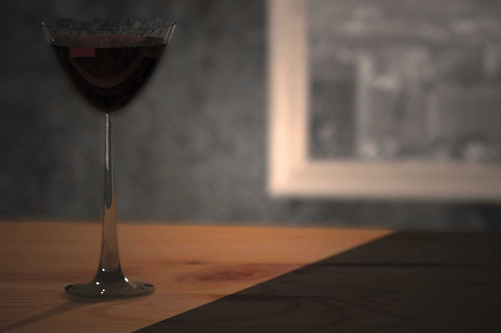
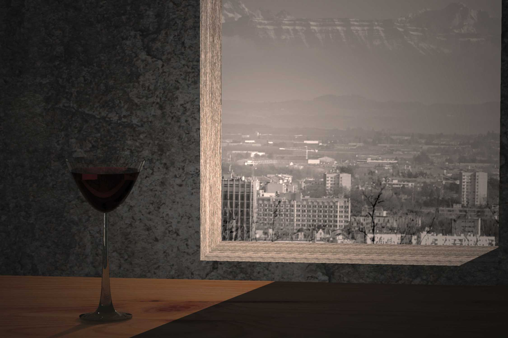
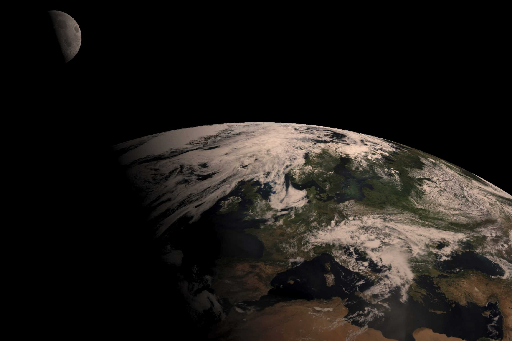
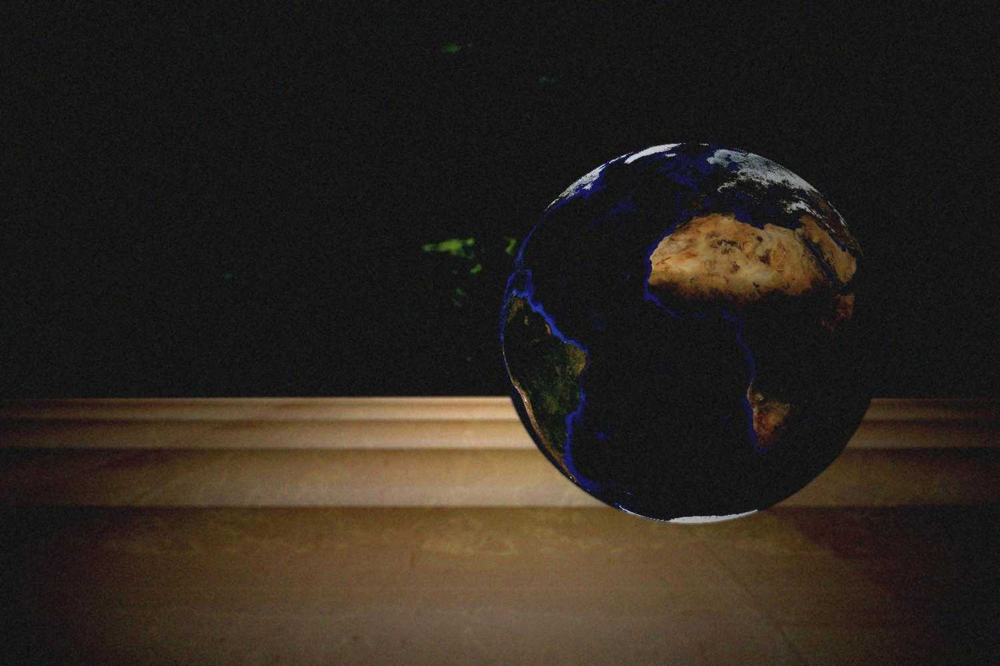
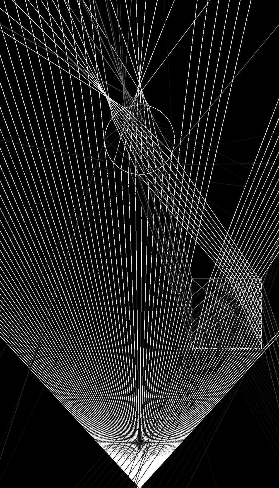

#RayTracing

##Description
A Raytracing program to create photo realistic pictures. Each pixel of the picture is generated by sending a ray from the camera position trough the scene. If an intersection is encountered, the ray may be reflected or refracted and may be split up in several rays.

##Sample Pictures:

##Instructions
**Dependencies:**

Qt5, Open MPI (and CMake for building)

**Building:**

        mkdir bin/
        cd bin/
        cmake ../src/
        make

**Running the program:**

Serial-mode:

        ./bin/raytracing  param/sample.scn

Parallel:

        mpirun -np 5  ./bin/raytracing  param/sample.scn

Piped:

        <e.g. physics_engine>  |  ./bin/raytracing

